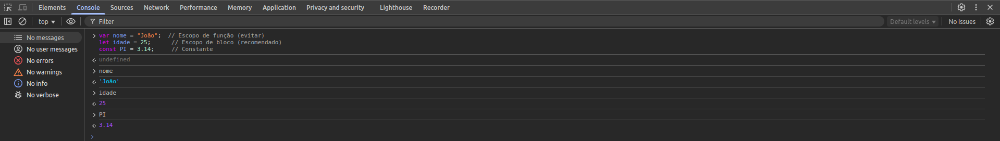

# Índice

1. [Como Executar JavaScript](#como-executar-javascript)
    - [No Navegador (Console do DevTools)](#no-navegador-console-do-devtools)
    - [Com Node.js (JavaScript no Back-end)](#com-nodejs-javascript-no-back-end)
2. [Fundamentos do JavaScript](#fundamentos-do-javascript)
    - [Sintaxe básica e tipos](#sintaxe-básica-e-tipos)
      - [Sintaxe básica](#sintaxe-básica)
      - [Comentários](#comentários)
      - [Declarações](#declarações)
      - [Estrutura de dados e tipos](#estrutura-de-dados-e-tipos)
    - [Operadores](#operadores)
      - [Operadores Matemáticos](#operadores-matemáticos)
      - [Operadores Comparativos](#operadores-comparativos)
      - [Operadores Lógicos](#operadores-lógicos)
    - [Estruturas de Controle](#estruturas-de-controle)
      - [if e else](#if-e-else)
      - [switch case](#switch-case)
    - [Estruturas de Repetição](#estruturas-de-repetição)
      - [Loop `for`](#loop-for)
      - [Loop `while` e `do...while`](#loop-while-e-dowhile)
      - [Loop `forEach` (em Arrays)](#loop-foreach-em-arrays)

Acesse o códigos [aqui](codigos/fundamentos.js)

## **Como Executar JavaScript**

### **No Navegador (Console do DevTools)**  

1. Abra o navegador (Chrome, Firefox, Edge).  
2. Pressione `F12` ou `Ctrl + Shift + I` para abrir o DevTools.  
3. Vá até a aba **Console** e digite código JavaScript.  



### **Com Node.js (JavaScript no Back-end)**  

1. Instale o [Node.js](https://nodejs.org/).  
2. Crie um arquivo `app.js` e escreva:  

    ```javascript
    var nome = "João"; 
    let idade = 25; 
    const PI = 3.14; 
    console.log(nome, idade, PI);
    ```

3. No terminal, execute:  

   ```sh
   node app.js
   ```

## **Fundamentos do JavaScript**  

### **Sintaxe básica e tipos**

#### Sintaxe básica

- JavaScript é case-sensitive e usa o conjunto de caracteres Unicode.

    ```javascript
    var nome = "nome escrito em minúsculo"; 
    var NOME = "nome escrito em maiúsculo"; 
    console.log(nome);
    console.log(NOME);
    ```

#### Comentários

```javascript
    // comentário de uma linha

    /* isto é um comentário longo
        de múltiplas linhas.
    */
```

#### Declarações

- Em JavaScript, podemos declarar variáveis com `var`, `let` ou `const`:

  - **var**: Declara uma variável

  - **let**: Declara uma variável local de escopo do bloco

  - **const**: Declara uma constante de escopo de bloco, apenas de leitura.

```javascript
var nome = "João";  // Escopo de função (evitar)
let idade = 25;      // Escopo de bloco (recomendado)
const PI = 3.14;     // Constante
```

- Uma variável declarada usando a declaração `var` ou `let` sem especificar o valor inicial tem o valor `undefined`.  
- Uma variável não declarada resultará no lançamento de uma exceção `ReferenceError`:

```javascript
var a;
console.log("O valor de a é " + a); // saída "O valor de a é undefined"
console.log("O valor de a é " + b); // executa uma exception de erro de referência (ReferenceError)
```

- O valor `undefined`:
  - pode ser usado para determinar se uma variável tem um valor
  - se comporta como falso (false), quando usado em um contexto booleano.
  - converte-se para `NaN` quando usado no contexto numérico.

```javascript
var myArray = [];
console.log(myArray);
console.log("myArray[0] é undefined?", myArray[0] === undefined); // true
if (myArray[0]){
     console.log("myArray[0] é true."); // não será executado
}
else {
    console.log("myArray[0] é false.");
}

var a;
console.log("Qual valor de a?", a + 2); // NaN

```

- O valor nulo se comporta como 0 em contextos numéricos e como falso em contextos booleanos

```javascript
var a = null
console.log("Valor de a é", a); 
console.log("Valor de a * 8:", a * 8); // null se comporta como  0.
console.log("Valor de a + 8:", a + 10); // null se comporta como  0.

console.log("a é null?", a === null);
if (a){
     console.log("a é true."); // não será executado
}
else {
    console.log("a é false.");
}
```

- Se cria uma constante por meio da palavra-chave `const` e deve ser inicializada com um valor. Não pode alterar seu valor por meio de uma atribuição ou ser declarada novamente enquanto o script está em execução.

```javascript
const  NA = null;
console.log("Valor de NA é", NA); // null

const PI = 3.14;
console.log("Valor de PI é", PI); // null
const PI = 3.1415; // SyntaxError: Identifier 'PI' has already been declared

const vm; // SyntaxError: Missing initializer in const declaration
```

#### **Estrutura de dados e tipos**

- Os principais tipos de dados em JavaScript são:  

| Tipo       | Exemplo              |
|------------|-------------------   |
| String     | `"Olá, mundo!"`      |
| Number     | `42`, `3.14`         |
| Boolean    | `true`, `false`      |
| Object     | `{nome: "Ana"}`      |
| Array      | `["Maçã", "Banana"]` |
| Null       | `null`               |
| Undefined  | `undefined`          |

```javascript
var string = "oLÁ, mUNDO!";
var number = 1;
var boolean = true;
var array = ["A", "B", "C"];
var object = {nome: "Fulano", idade: 30};
var nulo = null;
var indefinido = undefined;

console.log("string:", string);
console.log("number:", number);
console.log("boolean:", boolean);
console.log("array:", array);
console.log("object:", object);
console.log("nulo:", nulo);
console.log("indefinido:", indefinido);
```

- Não é necessário especificar o tipo de dado de uma variável, os tipos de dados são convertidos automaticamente conforme a necessidade durante a execução do script. É possível atribuir uma string para uma variável que foi declarada anteriormente com number :

```javascript
var resposta = 42;
console.log("resposta:", resposta); 
resposta = "A resposta é 42.";
console.log("resposta:", resposta);
```

> **ATENÇÃO**: Em expressões envolvendo valores numérico e string com o operador `+`, JavaScript converte valores numérico para strings.

```javascript
var resposta = "A resposta é " + 42; // "A resposta é 42"
console.log("resposta:", resposta);
resposta = 42 + " é a resposta";
console.log("resposta:", resposta); // "42 é a resposta"

console.log('"37" - 7 = ', "37" - 7); // 30
console.log("37 - 7 = ", 37 - 7); // 30

console.log('"37" + 7 = ', "37" + 7); // 377
console.log("37 + 7 = ", 37 + 7); // 44
```

### **Operadores**

#### **Operadores Matemáticos**  

```javascript
let a = 10, b = 5;
console.log("Adição", a + b);  // Adição (15)
console.log("Subtração", a - b);  // Subtração (5)
console.log("Multiplicação", a * b);  // Multiplicação (50)
console.log("Divisão", a / b);  // Divisão (2)
console.log("Módulo", a % b);  // Módulo (0)
console.log("Exponenciação", a ** b); // Exponenciação (100000)
```

#### **Operadores Comparativos**

- `===` : Retorna verdadeiro caso os operandos sejam iguais e do mesmo tipo.

```javascript
console.log('10 == "10"', 10 == "10");  // true (compara apenas valor)
console.log('10 === "10"', 10 === "10"); // false (compara valor e tipo)
console.log("10 != 5", 10 != 5);     // true
console.log("10 > 5", 10 > 5);      // true
console.log("10 <= 5", 10 <= 5);     // false
```

> **ATENÇÃO**: `(=>)` não é um operador, mas a notação para arrow functions

#### **Operadores Lógicos**  

```javascript
console.log("true && true = ", true && true);  // true  (AND)
console.log("false || true = ", false || true); // true  (OR)
console.log("!false = ", !false);        // true  (NOT)
console.log("true && false = ", true && false); // false (AND)
console.log("true || false = ", true || false); // true  (OR)
console.log("!true = ", !true);         // false (NOT)
```

### **Estruturas de Controle**  

#### **if e else**  

```javascript
let idade_maioridade = 18;
let idade_idoso = 65;
let idade = 30;

if (idade >= idade_idoso) {
    console.log("Idoso");
}
else if (idade >= idade_maioridade) {
    console.log("Maior de idade");
}
else {
    console.log("Menor de idade");
}
```

##### **switch case**

```javascript
let fruta = "Manga";
switch (fruta) {
    case "Laranja":
        console.log("O quilo da laranja está R$0,59.");
        break;
    case "Maçã":
        console.log("O quilo da maçã está R$0,32.");
        break;
    case "Banana":
        console.log("O quilo da banana está R$0,48.");
        break;
    case "Cereja":
        console.log("O quilo da cereja está R$3,00.");
        break;
    case "Manga":
        console.log("O quilo da manga está R$0,56.");
        break;
    case "Mamão":
        console.log("O quilo do mamão está R$2,23.");
        break;
    default:
        console.log("Desculpe, não temos " + fruta + ".");
}
```

### **Estruturas de Repetição**  

#### **Loop `for`**

```javascript
for (let i = 0; i < 5; i++) {
    console.log("i:", i);
}

var passo;
for (passo = 0; passo < 5; passo++) {
  console.log("passo", passo + 1);
}
```

#### **Loop `while` e `do...while`**

```javascript
var n = 0;
var x = 0;
while (n < 3) {
    console.log(`Iteração ${n + 1}`);
    console.log(`   > Valor inicial de x: ${x}`);
    
    n++;
    x += n;
    
    console.log(`   > Valor final de x após incremento: ${x}`);
    console.log("──────");
}
```

```javascript
var n = 0;
var x = 0;          
do {
    console.log(`Iteração ${n + 1}`);
    console.log(`   > Valor inicial de x: ${x}`);
    
    n++;
    x += n;
    
    console.log(`   > Valor final de x após incremento: ${x}`);
    console.log("──────────────────────────");
}
while (n < 3);
```

#### **Loop `forEach` (em Arrays)**

```javascript
let numeros = [10, 20, 30];
numeros.forEach(numero => console.log(numero));
```
